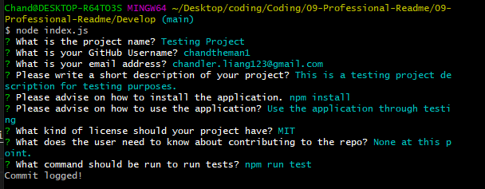

# 09-Professional-Readme

## Objective
This application helps developers create high quality README.md files for their projects.

## How to use it
Use the command "node index.js"
It will ask questions that will automatically fill out for you in README.MD
The README.md will be created in the Develop folder.

## Technologies Used

Node.js
FS (File System)
Inquirer

## Live Demonstration

[Google Drive](https://drive.google.com/file/d/1_nGyvUAvNDvheLApi7Fazqk0nirl5bVw/view?usp=sharing)

